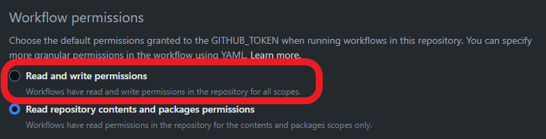
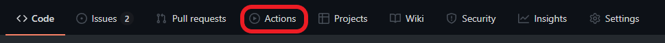
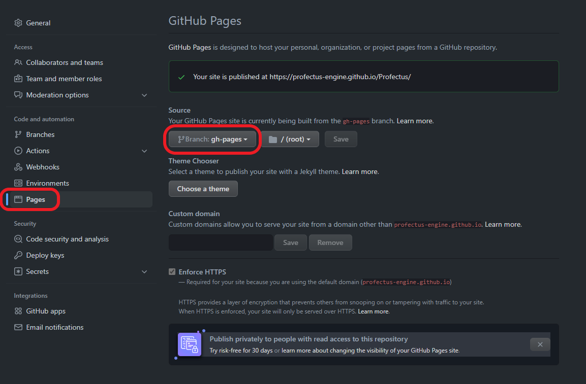

# Setting Up

Profectus requires a Node.js development environment for working on a project. If you are comfortable with the command line, a local development environment is recommended.

## Local Development

For local development, you will need the following tools:

- [git](https://git-scm.com/downloads)
- [node](https://nodejs.org/en/download/)

Create a new project from the [Profectus repository](https://github.com/profectus-engine/Profectus) by clicking the "Use this template" button. Then, clone the repository locally using the provided link.

::: info
The template repository allows easy creation of multiple projects from one repository. However, updating an existing project to a newer version of Profectus can be challenging. Consider [updating Profectus](https://chat.openai.com/updating.md) _before_ starting development to avoid issues with unrelated histories.
:::

It's recommended to create a new Git branch for development, allowing you to push changes without affecting the live build. The GitHub workflow will automatically rebuild the page when you push to the `main` branch.

Next, install Profectus' dependencies by running `npm install`. Run `npm run serve` to start a local server hosting your project. The site will automatically reload as you modify files.

Also, follow the steps to [update Profectus](https://chat.openai.com/updating.md) before starting to make future updates easier without worrying about unrelated histories.

### Deploying

Using Git, the repository's workflow action automates deployment. However, you need to grant write permissions for the action in the repository settings. Go to Actions, General, Workflow permissions, and select "Read and write permissions".

To deploy, push changes to the main branch. The site will be updated automatically in a few minutes. Check progress or errors from the Actions tab on your repository.

Enable GitHub Pages in the repo settings to host the generated site. Select the `gh-pages` branch. Perform this step once. This will automatically start another GitHub action to deploy the website.

Upon action completion, your project should be available at `https://<YOUR_GITHUB_USERNAME>.github.io/<YOUR_REPO_NAME>/`. For example, the TMT Demo project hosted at https://github.com/profectus-engine/TMT-Demo is available at https://profectus-engine.github.io/TMT-Demo/.

### Visual Studio Code Setup

If you don't have a preferred IDE, Profectus is developed in [Visual Studio Code](https://code.visualstudio.com) and is known to work well with it.

Recommendations:
- Use [Take Over Mode](https://github.com/johnsoncodehk/volar/discussions/471) for proper type analysis
- Turn off `.value` autocomplete by running the `Preferences: Open Settings` command and setting `volar.autoCompleteRefs` to `false`
- Install the [Vitest VS Code extension](https://marketplace.visualstudio.com/items?itemName=ZixuanChen.vitest-explorer&ssr=false#qna) for running and debugging unit tests (if working on the engine itself)

## Replit

As an alternative to local development, you may use [Replit](https://replit.com). Replit sets up your development and hosts your project.

On the free plan, you'll face limitations, and the program may need occasional startups.

To create a Profectus project on Replit, all you have to do is click this button:

Click the "Run" button at the top of the screen to start development. This will also make the project publicly accessible, essentially auto-deploying it. However, this means you cannot separate your development and production environments.

## Glitch

[Glitch](https://glitch.com) is a site similar to Replit, with many of the same pros and cons. To create a Profectus project on Glitch, select "New Project", "Import from GitHub", and enter `profectus-engine/Profectus`. The new project will be automatically configured and ready to go.
