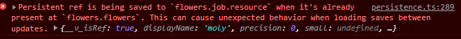

# Migrating to Profectus 0.6

Alongside the standard steps for [Updating Profectus](../getting-started/updating), this update contains numerous large or breaking changes. This guide will cover additional steps to follow after updating Profectus.

## Fixing save data

This update introduces a major change in save data collection and storage. The change reduces save data size and fixes issues that can cause persistent values to reset to default values. Unfortunately, developers will need to mark which persistent value uses should be included in the save data and which are merely references. Let's go through an example:

```ts
const flowers = createResource<DecimalSource>(0, "moly");
const job = createJob(name, () => ({
	/** snip **/
    resource: flowers
}));
/** snip **/
return {
	/** snip **/
	flowers,
	job
}
```

This example stores the same persistent data in two locations - `flowers.flowers` and `flowers.job.resource`. We can mark the latter usage as a reference by wrapping it in the [noPersist](../../api/modules/game/persistence#nopersist) utility, so it'd look like `resource: noPersist(flowers)`. Otherwise, you will encounter an error in the console when the layer is loaded:



Use these console errors to identify save data redundancy that needs correction. It is recommended to run the app and use the errors as a guide rather than trying to identify redundancies manually.

In addition to obtaining non-persistent refs from your persistent refs, you may need to wrap entire features containing persistent refs. For example, in Kronos, there are seven layers with "Job" features, which are combined into a dictionary in the main layer. This would cause the persistent state to appear in both layers, but you can wrap the dictionary in a noPersist call to bypass serialization, ensuring it only uses the jobs within their respective layers. Here's an example from Kronos:

```ts
const jobs = noPersist({
    flowers: flowers.job,
    distill: distill.job,
    study: study.job,
    experiments: experiments.job,
    generators: generators.job,
    breeding: breeding.job,
    rituals: rituals.job
}) as Record<JobKeys, GenericJob>;
```

The time required for this step depends on your project structure. You can use [this commit](https://github.com/thepaperpilot/Kronos/commit/6e8bfc1a78df0a7957de06bacdabf87c688b917c) to see all the changes made for Kronos, which used a utility function for similar features that limited the number of required changes.

## Breaking feature changes

### Achievements and Milestones

Achievements and milestones have been merged. Any existing achievements should now have the `small: true` property set to keep the same display as before. Milestones should now use the `createAchievement` constructor instead of `createMilestone`, and they will appear and behave as before.

### Buyables

Buyables have been renamed to "repeatables". To update your code, you'll need to replace all references to buyable with repeatable. Additionally, various properties have been removed or changed to no longer refer to purchases:

- `canAfford` no longer exists, and you should instead add conditions via the requirements system
- `onPurchase` should become `onClick`
- `purchase()` should become `click()`

### Requirements

Many features now use `requirements` properties where before they would have a cost or other condition. The `requirements` property takes a single `Requirement` object or an array of them. Requirements make it easier to support features requiring multiple currencies or other conditions.

When coupled with the formulas system, they also allow for scaling requirements that can be calculated efficiently. Here is an example repeatable that starts by costing 100 points and gets 1.05x more expensive with each purchase, compounding. Thanks to formulas the repeatable will be able to immediately increase as many levels as the player can afford at once:

```ts
const myRepeatable = createRepeatable(() => ({
    requirements: createCostRequirement(() => ({
        resource: points,
        cost: Formula.variable(myRepeatable.amount).pow(1.05).times(100)
    })),
    maximize: true
}));
```

To update an existing non-scaling cost requirement, wrap your current cost function and resource property as follows:

```ts
const upgrade = createUpgrade(() => ({
	requirements: createCostRequirement(() => ({
	    cost: () => Decimal.pow(priceRatio, unref(machines.amount)),
	    resource: generators.energeia,
	}))
}));
```

For other conditions, you can use the `createBooleanRequirement` constructor instead:

```ts
const spellExpMilestone = createAchievement(() => ({
    requirements: createBooleanRequirement(() => Decimal.gte(job.rawLevel.value, 2)),
}));
```

Learn more about requirements and their capabilities in [this guide page](../important-concepts/requirements).

### Formulas

Formulas are a new feature that allows for scaling cost or effect functions to be inverted or integrated without requiring the developer to code anything beyond the original formula. They can simplify support for "buy max" functionalities and make conversions easier to read and write.

Any cost requirements can now accept a formula instead of a cost function. The formula system can then handle determining how many purchases can be made at once. To continue the example above, here's how it would be rewritten:

```ts
requirements: createCostRequirement(() => ({
    cost: Formula.variable(machines.amount).pow_base(priceRatio),
    resource: generators.energeia,
}))
```

Conversions work a bit differently. Their scaling function system has been replaced with a `formula` property that takes a lambda - it provides the input formula variable, representing the base resource, as a parameter, and you return a formula representing the amount of the gain resource that could be converted. For example, if you previously had code like this:

```ts
scaling: addSoftcap(createPolynomialScaling(10, 0.5), 1e100, 0.5)
```

you can now write this:

```ts
formula: x => x.div(10).sqrt().step(1e100, f => f.sqrt())
```

Learn more about formulas and their capabilities in [this guide page](../important-concepts/formulas).

### Modifiers

Modifiers now display negative effects in red. The current implementation assumes any value that reduces the result is negative, and the output being less than the base value is a negative outcome. However, for some modifiers, this may be the opposite of what you want - for example, a cooldown being reduced below its base value is a positive effect. For those modifiers, set the `smallerIsBetter` property to `true`. This property also exists when creating collapsible modifier sections.

Modifiers have renamed their `revert` property to `invert` to match the terms used by formulas. Update any custom modifiers you've created accordingly.

### Custom Features

Lazy proxies now call the options function with the base object as the `this` argument and the first parameter. Features with `options` functions are expected to pass the base object as the `this` argument and first parameter as well. The `OptionsFunc` type has already been updated for this, so TS will complain if you skip this migration step.

## Fixing visibility changes

Visibility properties now work with booleans, which has several implications.

The `showIf` util is no longer necessary and has been removed - simply return the boolean value itself. In fact, if you were previously passing a computed boolean into `showIf`, you can now use the computed ref directly, reducing overhead. Here's an example:

```ts
visibility() {
    return showIf(spellExpMilestone.earned.value);
}
```

This code can now be simplified to:

```ts
visibility: spellExpMilestone.earned
```

Be aware that using the computed ref directly instead of a function can cause circular dependency issues. If you encounter one while simplifying a visibility property, resolve the issue or continue using a function, returning the computed ref value.

### Custom Components

If you created any custom features with their own Vue components, you'll need to update them to support booleans for visibility values. This means replacing **ALL** equality checks for specific visibilities with calls to [isVisible](../../api/modules/features/feature#isvisible) and [isHidden](../../api/modules/features/feature#ishidden).

While updating your component, you may need to cast the component to [GenericComponent](../../api/modules/features/feature#genericcomponent).
