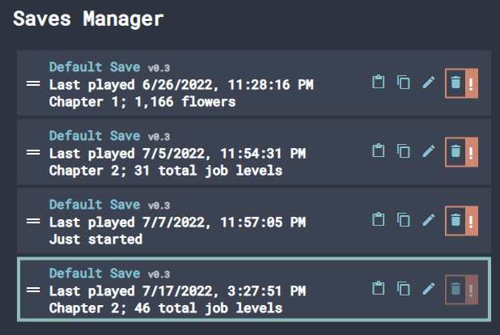

# Display Save Progress

This is a recipe to add a section to each save in the Saves Manager that will describe the amount of progress within that save. This can allow the player to more easily compare the saves to determine which is which. This would be in addition to the game version, last time played, and the name of the save itself, which can already be used for comparing saves without any configuration.



This recipe will involve modifying the `Save.vue` file within your project to include an extra component in the saves details. It will go over creating the new component, how to work with the save data object, and then displaying the component.

## Creating the component

Let's start with creating the coerced component. For this recipe we're going to make a couple assumptions about what this display should be. We'll assume the text will be more complex than displaying a single value. That is, at different stages of the game progress will be indicated by different metrics. We'll also assume it will be a single line of descriptive text - no images or anything else that would justify making a new .vue component. Breaking these assumptions is left as an exercise for the reader. But for now, with those assumptions in mind, we'll write our component (in the `<script>` tag in `Save.vue`) similar to this example:

```ts
const progressDisplay = computed(() => {
	if (someCondition) {
		return "Just started";
	}
	if (someOtherCondition) {
		return `Early game; ${formatWhole(someResourceValue)} resource name`;
	}
	...
	return "Unknown progress";
});
```

This code will create a component that will simply render the returned text, and update as required. However, there's one significant complication in writing the code for these conditions and resource values: you're working with a potentially incomplete save data object.

## Working with save data

The save component is passed down a save data object, that works quite a bit differently than how most of your project accesses data. First off, you are typically working with the objects within a layer directly, but you can't here as you want the information from this specific save, not the currently loaded save. Structurally it'll be like the `player` object, where all computed values and non-persistent refs are stripped away, and refs are already unwrapped. However, unlike the `player` object, you don't know for certain any given property is there - saves can be corrupted or incomplete, or come from older versions of the game that simply had the data structured differently. You'll need to account for that appropriately.

For most cases (specifically where new game versions only added new data to the save data object, rather than change the meaning of existing data), you can use the `LayerData` type to get proper typing for a given layer. For example, a type safe check for whether a save has earned a milestone called "nextSectionOfGame" on a layer called "main" would look like this:

```ts
if ((save.value?.layers?.main as LayerData<typeof main> | undefined)?.nextSectionOfGame.earned ?? false) {
	return "Next section of game reached";
}
```

## Displaying the component

The `Save.vue` template contains, amongst other things, an element that displays the details of the save. We'll be adding a new child within this element. You'll want to look near the bottom of the template for the element that looks like `<div class="details" v-if="save.error == undefined && !isEditing">`. Note that there are _two_ divs with this CSS class, and we specifically want the one that's active when isEditing is `false`. You'll then want to add our new element inside this div, like so:

```html
<div class="details" v-if="save.error == undefined && !isEditing">
    <button class="button open" @click="emit('open')">
        <h3>{{ save.name }}</h3>
    </button>
    <span class="save-version">v{{ save.modVersion }}</span
    ><br />
    <div v-if="currentTime" class="time">
        Last played {{ dateFormat.format(currentTime) }}
    </div>
    <div v-if="progressDisplay">{{ progressDisplay }}</div>
</div>
```

And there you have it! Your dev environment should now show the component in all its glory in the saves manager.
