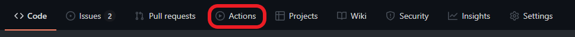

# Setting Up

Profectus requires a node development environment in order to work on a project. If you are comfortable with the command line, it is recommended to use a local development environment.

## Local Development

You will require the following tools for local development:

- [git](https://git-scm.com/downloads)
- [node](https://nodejs.org/en/download/)

Create a new project from the [Profectus repository](https://github.com/profectus-engine/Profectus) via the "Use this template" button. You can then copy the link for the repository to clone it locally.

::: info
Since the repository is a template repository, you can easily create multiple projects from one repository. However, it does make updating an existing project to a newer version of Profectus more difficult.
:::

It's recommended to create a new git branch for development, so you can push your changes without it affecting the live build. This allows you to continue working with smaller commits, and only release new versions when you're actually ready to. The github workflow will automatically rebuild the page whenever you push to the `main` branch.

The next step is to install Profectus' dependencies. This is as simple as running `npm install`.

You can now run `npm run serve` to start a local server that will host your project so you can work on it. As you change files the site will automatically reload them.

### Deploying

If you're using git, deploying is as easy as pushing your changes to the `main` branch. In a couple minutes the site will be updated fully automatically. If you'd like to see progress on it, or look at any errors that happened, you can do so from the actions tab on your repository.

Before github knows to actually host the generated site, you'll have to enable github pages in the repo settings. This just means selecting the branch to use - `gh-pages`. You will only need to perform this step once. This will automatically start another github action to deploy the website.

Once the action completes, your project should be available at `https://<YOUR_GITHUB_USERNAME>.github.io/<YOUR_REPO_NAME>/`. For example, the TMT Demo project hosted at https://github.com/profectus-engine/TMT-Demo is available at https://profectus-engine.github.io/TMT-Demo/.

### Visual Studio Code Setup

If you don't already have a preferred IDE, Profectus is currently developed in [Visual Studio Code](https://code.visualstudio.com) and is known to work well with that IDE in particular. It's recommend to use [Take Over Mode](https://github.com/johnsoncodehk/volar/discussions/471) for proper type analysis, and consider turning off `.value` autocomplete by running the `Preferences: Open Settings` command and setting `volar.autoCompleteRefs` to `false`.

## Replit

As an alternative to local development, you may use [replit](https://replit.com), which will automatically set up your development environment for you and also host your project itself.

However, on the free plan you will be limited by the amount of resources you can use, and the program will need to start up occasionally.

To create a Profectus project on replit, all you have to do is click this button:

You can then start the developing by clicking the "Run" button at the top of the screen. This will also make the project run publicly, so you could consider it as automatically deployed. This does mean you cannot have a separate development environment from your production environment, however.

## Glitch

[Glitch](https://glitch.com) is a site similar to replit, with much the same pros and cons. To create a projectus project on glitch, select "New Project", "Import from GitHub", and then type in `profectus-engine/Profectus`. The new project will be created and should be automatically configured and ready to go.
